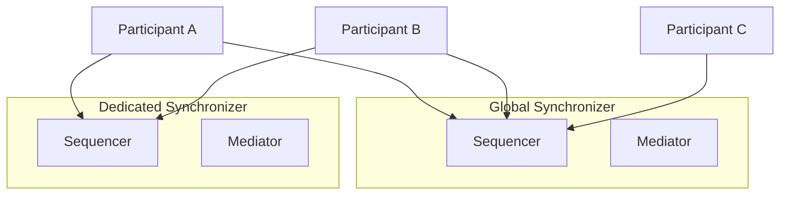

import CANTON_DOCS_CN_GS_EXTENSION_SYNCHRONIZERS_PRIVATE_SYNCHRONIZERS_0 from "/snippets/external/canton/main/docs-open/target/snippet_json_data/docs-cn/global-synchronizer-extension-synchronizers-private-synchronizers-0.mdx";

Canton Network applications are not limited to just the Global Synchronizer. You can operate dedicated synchronizers (also called extension synchronizers or private synchronizers) alongside the Global Synchronizer for workloads that require different privacy, performance, or governance characteristics.

## Why Dedicated Synchronizers

The Global Synchronizer is the public backbone of Canton Network — it provides the synchronization layer for Canton Coin, identity management, and cross-organizational workflows. But some workloads have requirements that are better served by a dedicated synchronizer:

- **Privacy** — Transaction data on a dedicated synchronizer is only visible to the stakeholder parties, not to the entire MainNet.
  You can hedge the “harvest now, decrypt later” quantum threat by keeping your contracts on a dedicated synchronizer.
- **Performance** — A dedicated synchronizer can be tuned for specific throughput and latency requirements without being affected by other network traffic.
- **Control and Compliance** — You may need your own synchronizer for regulatory, security, or operational reasons.
- **Reserved bandwidth** — You can view it as hardware and bandwidth reserved for your workload — still one network, adding capacity for everyone.

A dedicated synchronizer is not a private blockchain but dedicated capacity on the shared Canton Network. That's why it is “dedicated” and not “private.”

## How It Works

A dedicated synchronizer runs its own sequencer and mediator nodes. Participants connect to both the Global Synchronizer (for Canton
Coin and cross-network interoperability) and one or more dedicated synchronizers (for application-specific transactions).

Canton's multi-synchronizer protocol allows a single participant to be connected to multiple synchronizers simultaneously. Contracts
can be assigned to any connected synchronizer, and the Canton protocol handles cross-synchronizer transactions automatically when
contracts on different synchronizers need to interact.

In this example, Participants A and B are connected to both synchronizers and can transact on either. Participant C only connects to the Global Synchronizer and cannot interact with contracts on the dedicated synchronizer.

## Dedicated Synchronizer Requirements

Organizations deploying or planning to deploy a dedicated synchronizer must understand the following operational obligations:

- **Canton Coin (CC) Fee Burning:** a dedicated synchronizer's validators will be required to burn CC on Canton Network in the near
  future.
- **Global Synchronizer Compatibility:** a dedicated synchronizer must remain compatible with the Global Synchronizer at all times.
  Validators are required to adopt mandated upgrades on a timely basis to maintain network interoperability.
- **Maintained Global Synchronizer Connection:** Organizations operating a dedicated synchronizer must maintain a persistent connection
  to the Global Synchronizer for accounting and settlement purposes. This connection is the mechanism by which fees are calculated
  and CC burn obligations are fulfilled.

## When to Use a Dedicated Synchronizer

Dedicated Synchronizers make sense when:

- Your application processes high-volume transactions between a known set of participants so a dedicated synchronizer is more economical.
- Regulatory requirements mandate that transaction data stays within a specific jurisdiction or infrastructure.
- You need guaranteed performance characteristics independent of Global Synchronizer load.
- Your workflow involves bilateral or multilateral agreements that don't need to be visible to the broader network.  This is a hedge for the “harvest now, decrypt later” quantum threat.

Dedicated Synchronizers are not needed when:

- You only need maximum interoperability with other Canton Network applications and wallets.
- You prefer the operational simplicity of a single synchronizer connection.

## Deployment Models

### Self-Operated

You run your own sequencer and mediator nodes. This gives you full control over infrastructure, configuration, and access policies. You are responsible for availability, backups, and upgrades.

### Operated by a Third Party

A trusted third party runs the synchronizer infrastructure on your behalf. You connect your participant to their sequencer
endpoints. The operator controls the infrastructure, but Canton's privacy model ensures they cannot see the contents of your
transactions — they only see encrypted message envelopes.

### Multi-Operator (BFT)

Multiple organizations collectively operate the synchronizer using a decentralized governance via BFT consensus protocol (similar to the Global Synchronizer
model but with a smaller, private operator set). This provides resilience against any single operator going offline or behaving
maliciously.

## Connecting to a Dedicated Synchronizer

Validators connect to a dedicated synchronizer through the Canton Admin API or Canton Console. The connection requires the sequencer's endpoint URL and appropriate authentication credentials.

<CANTON_DOCS_CN_GS_EXTENSION_SYNCHRONIZERS_PRIVATE_SYNCHRONIZERS_0 />

Once connected, the validator can create contracts on the dedicated synchronizer by specifying it as the target synchronizer in transaction submissions.

## Relationship with the Global Synchronizer

Dedicated synchronizers and the Global Synchronizer are complementary:

- **Canton Coin** operations always use the Global Synchronizer.
- **Smart contracts**, while residing solely on validators, can be assigned to any synchronizer, depending on your requirements.
- **Cross-synchronizer transactions** are possible when contracts on different synchronizers need to interact. Canton handles the
  coordination automatically or the synchronizer can be specified.

## Next Steps

- [Hybrid Synchronizer Pattern](/global-synchronizer/extension-synchronizers/hybrid-synchronizer-pattern) — Combining public and dedicated synchronizers
- [Linking Validators](/global-synchronizer/extension-synchronizers/linking-validator-multi-sync) — Multi-synchronizer validator configuration
