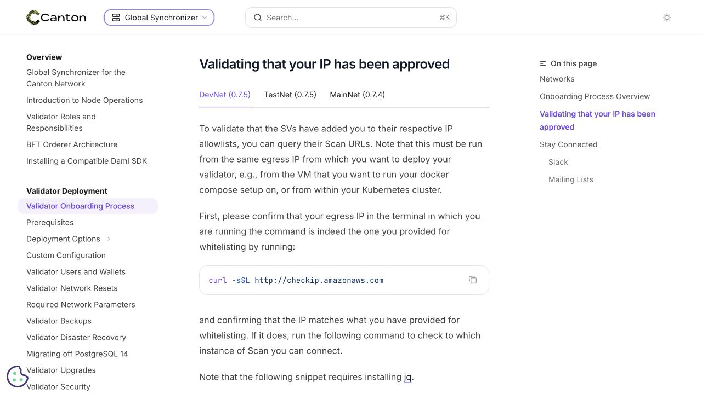
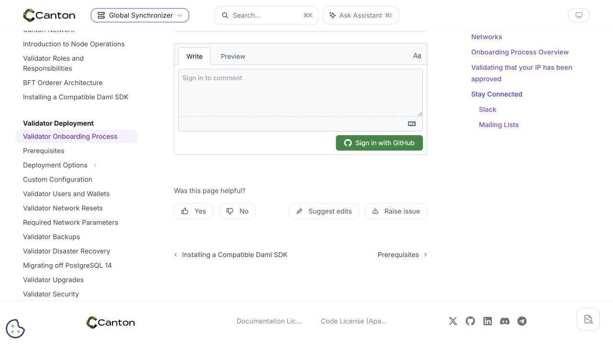

# Source/output migration verification

The corpus is authored in `docs-source/` and copied/rendered into `docs-main/`.
The 28 former network-variable fragments are inline in their 14 owning source
pages. Mintlify's deployment directory and all public routes stay the same.

Against current main `1b18e1ec`, every retained output file is byte-identical except
network block comments pointing to the new owning source page. This comparison
covers text, link targets, network values, navigation, and binary assets.

The updated validator regenerates the expected content in memory and compares
all output paths and bytes, including missing, extra, and already-dirty files.
It does not write to either tree. Source deletions are mirrored during a build.

Validation:

- 78 focused Python tests and four Node tests passed.
- JSON Ledger OpenAPI regeneration produced no reader-output drift.
- Mintlify build validation passed.
- Full Python suite: 357 passed, 5 skipped, 8 failures; all eight failures also
  reproduce on unchanged baseline `aaa9e325` (four Javadoc version expectations,
  two Protobuf lifecycle expectations, a product-selector navigation expectation,
  and a stale copied cross-reference expectation).
- `git diff --check --find-copies-harder -C aaa9e325 HEAD` passes. Copy detection
  distinguishes inherited corpus whitespace from new changes.

The local preview shows the unchanged static network tabs:



On the [hosted preview](https://cantonfoundation-network-vars-source-output.mintlify.site/global-synchronizer/deployment/onboarding-process),
“Suggest edits” is absent before consent. After accepting the Osano banner it
points to:

```
https://github.com/canton-network/cf-docs/edit/network-vars-source-output/docs-source/global-synchronizer/deployment/onboarding-process.mdx
```

After navigating through the sidebar to Prerequisites, the link updates to the
matching `docs-source/global-synchronizer/deployment/prerequisites.mdx` file.
The screenshot shows the post-consent toolbar whose destination was verified:



GitHub checks: DCO, network-variable validation, Mintlify build validation, and
hosted deployment passed. Mintlify's separate link-rot check was skipped.

## Automation path audit

All 21 scheduled targets write source first, render the site, and include both
source and output in their commit paths. Source-change detection remains scoped
to the inputs. The artifact-download workflow copies external snippets into
`docs-source/` and builds before opening its update PR. The reference inventory,
output validators, and Mintlify deployment intentionally retain `docs-main/`.

The follow-up audit restored four Canton snippet identifiers: `docs-main` inside
those names is part of the existing import destination, not the site's root.
A regression test fails with the renamed identifiers and passes after restoring
them. Another test exercises real snippet extraction, source copying, site
rendering, and output drift validation. The 69 focused rendering, automation,
and snippet tests pass; these now run together in CI.

The live dashboard generator succeeded in an isolated copy with no upstream
changes. A controlled MainNet substitution change then rebuilt ten output files;
every changed config, source, and output file was covered by the dashboard
target's commit paths, and output validation passed. This did not publish an
automated PR or exercise every reference generator's upstream service.

The merged topology generator from #1549 now writes its table into `docs-source/`.
Its scheduled target runs both topology generators before rendering and commits
both source and output. The aggregate reference runner retains the new generator.
Main's six-DAR dashboard changes from #1586 are also preserved in source.

The expanded suite passes 114 focused tests, including a regression that fails
with the old topology output path, then verifies source generation, publication,
and drift checking. The topology tests also run in Mintlify's Nix validation job.
Real regeneration from the public Canton `v3.5.15` release reproduces the merged
table. The topology page and both merged dashboard files remain byte-identical
to main after rebuilding; all 14 network pages still differ only in source comments.

Existing open branches must adopt the source root when rebased:

| PR | Integration requirement |
| --- | --- |
| [#1519](https://github.com/canton-network/cf-docs/pull/1519) | The snippet lifecycle CLI writes snippets and scans page imports in `docs-main`; move authoring operations to `docs-source` and build output. |
| [#1067](https://github.com/canton-network/cf-docs/pull/1067) | Preserve this PR's source artifact destination and build step when merging the snippet workflow changes. |
| [#1567](https://github.com/canton-network/cf-docs/pull/1567) | Preserve source/output generation and validation while merging the Nix command changes. |

Documentation edits on other existing branches must also move to source before
rebuilding; editing output alone fails the full-corpus drift check.
